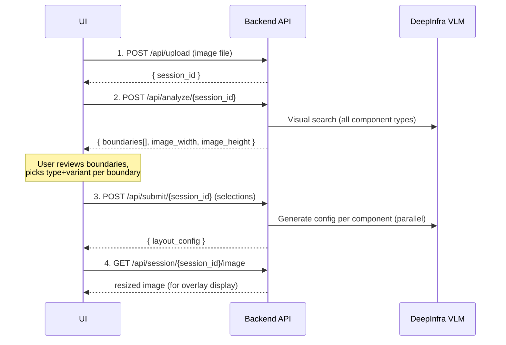

# Backend API Integration Guide

This document describes the backend API for the Boundary Overlay Builder. Use this as a reference when building the frontend in a separate repository.

**Base URL:** `http://localhost:8000`

---

## Overall Flow



---

## API Endpoints

### 1. Upload Image

**`POST /api/upload`**

Upload the UI design screenshot to create a new session.

**Request:**

- Content-Type: `multipart/form-data`
- Body: `file` (image file -- png, jpg, webp)

**Response (200):**

```json
{
  "session_id": "e225fadf",
  "message": "Image uploaded successfully"
}
```

**Notes:**

- Store the returned `session_id` -- it is required for all subsequent calls.
- Only image content types are accepted; other file types return 400.

---

### 2. Analyze Image

**`POST /api/analyze/{session_id}`**

Triggers VLM-based component detection. The backend searches for all known component types and variants in the uploaded image using visual grounding.

**Request:**

- Path param: `session_id` (from upload response)
- Body: none

**Response (200):**

```json
{
  "boundaries": [
    {
      "id": "b-1",
      "bbox": { "x1": 45, "y1": 208, "x2": 502, "y2": 655 },
      "candidates": [
        { "type": "billingHistory", "variant": "compact", "confidence": 90.0 },
        { "type": "billingHistory", "variant": "standard", "confidence": 90.0 },
        { "type": "subscriptionList", "variant": "compact", "confidence": 90.0 }
      ]
    },
    {
      "id": "b-3",
      "bbox": { "x1": 541, "y1": 61, "x2": 981, "y2": 580 },
      "candidates": [
        { "type": "invoiceDetails", "variant": "default", "confidence": 90.0 },
        { "type": "accountDetails", "variant": "card", "confidence": 85.0 }
      ]
    },
    {
      "id": "b-5",
      "bbox": { "x1": 53, "y1": 687, "x2": 984, "y2": 918 },
      "candidates": [
        { "type": "billingAddress", "variant": "standard", "confidence": 90.0 }
      ]
    }
  ],
  "image_width": 1024,
  "image_height": 981
}
```

**Notes:**

- This is a **long-running call** (30-60 seconds). Show a loading state in the UI.
- You can poll `GET /api/session/{session_id}` and check `status` to track progress.
- Each boundary has a unique `id`, a `bbox` (pixel coordinates relative to the resized image), and a list of `candidates` sorted by confidence.
- Overlapping regions have already been de-duplicated by the backend (IoU-based).
- Only matches with confidence >= 80% are returned.

---

### 3. Submit Selections

**`POST /api/submit/{session_id}`**

Submit the user's confirmed selections. The backend crops each region, sends each crop to the VLM for full configuration generation (in parallel), computes the layout structure, and returns the complete portal config.

**Request:**

- Path param: `session_id`
- Content-Type: `application/json`
- Body:

```json
{
  "selections": [
    {
      "id": "b-1",
      "type": "billingHistory",
      "variant": "compact",
      "bbox": { "x1": 45, "y1": 208, "x2": 502, "y2": 655 }
    },
    {
      "id": "b-3",
      "type": "invoiceDetails",
      "variant": "default",
      "bbox": { "x1": 541, "y1": 61, "x2": 981, "y2": 580 }
    },
    {
      "id": "b-5",
      "type": "billingAddress",
      "variant": "standard",
      "bbox": { "x1": 53, "y1": 687, "x2": 984, "y2": 918 }
    }
  ]
}
```

Each selection requires:

| Field     | Type   | Description                                        |
|-----------|--------|----------------------------------------------------|
| `id`      | string | Boundary id from the analysis response             |
| `type`    | string | Chosen component type (from the selected candidate)|
| `variant` | string | Chosen variant (from the selected candidate)       |
| `bbox`    | object | Bounding box -- pass through from analysis         |

**Response (200):**

```json
{
  "status": "submitted",
  "count": 3,
  "layout_config": {
    "sections": [
      {
        "id": "section-1773403239368-1",
        "layout": "twoColumn",
        "splitRatio": 50,
        "regionComponents": {
          "left": [
            {
              "name": "billingHistory-1773403239368",
              "type": "billingHistory",
              "option": {
                "variant": "compact",
                "columns": ["date", "invoiceNumber", "heroItem", "totalAmount", "status", "view"],
                "enableFiltering": true,
                "pageSize": 5,
                "features": {
                  "showPayNow": true,
                  "showDownload": true,
                  "showView": true,
                  "showExpandableRows": false,
                  "showAccountSummary": true,
                  "showPagination": true
                },
                "titleText": "Billing History",
                "defaultVisible": true,
                "buttonActions": {
                  "payNow": { "standard": "collect_now" },
                  "download": { "standard": "download_pdf" }
                }
              }
            }
          ],
          "right": [
            {
              "name": "invoiceDetails-1773403239368",
              "type": "invoiceDetails",
              "option": {
                "variant": "default",
                "title": "Invoice Details",
                "invoiceId": "",
                "features": {
                  "showDownload": true,
                  "showPayNow": true
                },
                "buttonActions": {
                  "payNow": { "standard": "collect_now" },
                  "download": { "standard": "download_pdf" }
                },
                "defaultVisible": true
              }
            }
          ]
        }
      },
      {
        "id": "section-1773403239368-2",
        "layout": "fullWidth",
        "splitRatio": 25,
        "regionComponents": {
          "main": [
            {
              "name": "billingAddress-1773403239368",
              "type": "billingAddress",
              "option": {
                "variant": "standard",
                "features": {
                  "showEdit": true,
                  "showSave": true,
                  "showCancel": true,
                  "showAddressFields": true,
                  "showTaxFields": false,
                  "showEInvoicingFields": false
                },
                "buttonActions": {
                  "save": { "standard": "update_billing_address" }
                },
                "defaultVisible": true
              }
            }
          ]
        }
      }
    ]
  }
}
```

**Notes:**

- This is a **long-running call** (10-30 seconds depending on number of components).
- The `layout_config` is the **final output** -- a complete portal configuration.
- Boundaries the user doesn't want should simply be omitted from the `selections` array.
- If config generation fails for a component, the backend falls back to a skeleton config with just the variant set.

---

### 4. Get Session Image

**`GET /api/session/{session_id}/image`**

Returns the resized image (PNG) used for analysis. Use this to display the image with boundary overlays.

**Response:** Binary image (PNG), `Content-Type: image/png`

---

### 5. Get Cropped Image

**`GET /api/session/{session_id}/cropped/{filename}`**

Returns a specific cropped component image (created during submit).

- Filename format: `{type}_{variant}_{boundary_id}.png`
- Example: `billingHistory_compact_b-1.png`

**Response:** Binary image (PNG)

---

### 6. Get Session State

**`GET /api/session/{session_id}`**

Returns the full session state. Useful for polling progress or resuming a session.

**Response (200):**

```json
{
  "session_id": "e225fadf",
  "status": "analyzed",
  "analysis": {
    "boundaries": [...],
    "image_width": 1024,
    "image_height": 981
  },
  "selections": null
}
```

**Status values:**

| Status              | Meaning                                               |
|---------------------|-------------------------------------------------------|
| `uploaded`          | Image uploaded, ready for analysis                    |
| `analyzing`         | VLM-based component detection in progress             |
| `analyzed`          | Analysis complete, boundaries available               |
| `generating_config` | User submitted selections, config generation underway |
| `submitted`         | Config generated, layout_config available             |
| `error`             | Something went wrong                                  |

---

## Bbox Coordinate System

All `bbox` values are **pixel coordinates** relative to the resized image dimensions returned in `image_width` and `image_height`:

- `x1, y1` = top-left corner
- `x2, y2` = bottom-right corner

The backend resizes uploaded images to `IMAGE_WIDTH=1024` (preserving aspect ratio).

To draw overlays at the correct position and size on screen:

```
scaleFactor = displayWidth / image_width

overlay.x      = bbox.x1 * scaleFactor
overlay.y      = bbox.y1 * scaleFactor
overlay.width  = (bbox.x2 - bbox.x1) * scaleFactor
overlay.height = (bbox.y2 - bbox.y1) * scaleFactor
```

---

## Component Types & Variants

| Type                    | Variants                                     |
|-------------------------|----------------------------------------------|
| `billingHistory`        | `compact`, `standard`, `detailed`            |
| `subscriptionList`      | `compact`, `standard`, `detailed`            |
| `subscriptionDetails`   | `compact`, `standard`, `detailed`            |
| `invoiceDetails`        | `default`                                    |
| `paymentMethodList`     | `default`                                    |
| `paymentMethodDetails`  | `default`                                    |
| `billingAddress`        | `compact`, `standard`, `stacked`             |
| `accountDetails`        | `card`, `list`                               |
| `usage`                 | `allInvoices`, `singleInvoice`, `staticChart`|

---

## Layout Config Structure

The `layout_config` returned by the submit endpoint follows this structure:

```json
{
  "sections": [
    {
      "id": "section-{timestamp}-{index}",
      "layout": "fullWidth | twoColumn | sidebar",
      "splitRatio": 25,
      "regionComponents": {
        "<region>": [
          {
            "name": "{type}-{timestamp}",
            "type": "{componentType}",
            "option": { ... }
          }
        ]
      }
    }
  ]
}
```

### Layout types and their regions

| Layout       | Regions                 | Description                          |
|--------------|-------------------------|--------------------------------------|
| `fullWidth`  | `main`                  | Single column spanning full width    |
| `twoColumn`  | `left`, `right`         | Two equal columns side by side       |
| `sidebar`    | `sidebar`, `content`    | Narrow sidebar + wide content area   |

### How layout is determined

- Components on the same horizontal row (Y-center within 50px tolerance) are grouped together.
- A single component in a row becomes `fullWidth`.
- Two components of similar width (~45-55% ratio) become `twoColumn` with `splitRatio: 50`.
- Two components of different widths become `sidebar` with `splitRatio` set to the narrower component's percentage.

---

## What the UI Needs to Implement

### Screen 1: Image Upload

- File picker for image upload (png/jpg/webp)
- Call `POST /api/upload` with the selected file
- Store the returned `session_id`
- Navigate to the analysis screen

### Screen 2: Analysis (Loading)

- Call `POST /api/analyze/{session_id}`
- Show a loading/progress indicator (30-60 seconds)
- Optionally poll `GET /api/session/{session_id}` to check `status`
- On completion, move to the boundary review screen

### Screen 3: Boundary Review & Selection

- Fetch the image via `GET /api/session/{session_id}/image`
- Render the image in a container
- Draw colored rectangle overlays for each boundary using `bbox` coordinates (scale to display size)
- For each boundary, show the list of `candidates` (type + variant + confidence %)
- Let the user pick one candidate per boundary (default to the highest confidence)
- Let the user discard boundaries they don't want (omit from submit)
- Provide a "Submit" / "Generate Config" button

### Screen 4: Config Generation (Loading)

- Call `POST /api/submit/{session_id}` with the user's selections
- Show a loading indicator (10-30 seconds)
- On completion, move to the results screen

### Screen 5: Results

- Display the returned `layout_config` JSON (code viewer / tree view)
- Provide a "Download JSON" or "Copy to Clipboard" action
- Optionally render a visual preview of the layout sections

---

## Error Handling

| Status Code | Meaning                                         |
|-------------|--------------------------------------------------|
| 400         | Invalid file type (not an image)                 |
| 404         | Session not found or image not found             |
| 500         | Analysis or config generation failed (see detail)|

All error responses follow this shape:

```json
{
  "detail": "Human-readable error message"
}
```
